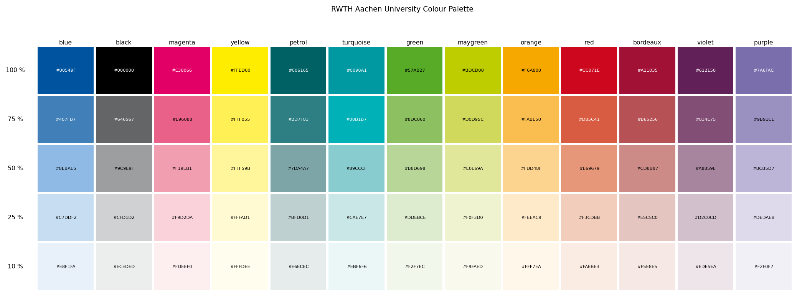
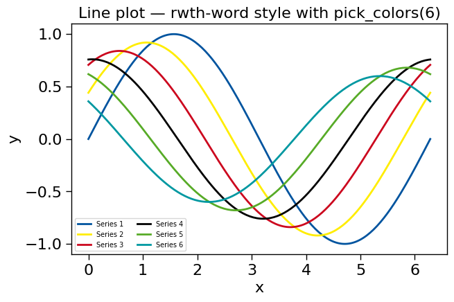

# rwthplots — RWTH Aachen University colours for Matplotlib

Matplotlib style sheets, colormaps, and colour utilities based on the
RWTH Aachen University corporate design palette.

## Gallery

**RWTH colour palette** — 13 base colours × 5 tint levels



**Line plot with `context()` and `pick_colors(6)`**



**Colormaps** — selection of available maps


**Climate stripes** — Nordrhein-Westfalen 1881–2025, DWD area average, RWTH blue / red


## Installation

```sh
pip install rwthplots
```

Or install the latest development version directly from GitHub:

```sh
pip install git+https://github.com/RWTH-IAEW/rwthplots.git

# Editable install for development
git clone https://github.com/RWTH-IAEW/rwthplots.git
cd rwthplots
pip install -e .
```

Requires Python ≥ 3.10 and Matplotlib ≥ 3.7.

## Quick start

```python
import rwthplots                    # registers all colormaps and styles on import
import matplotlib.pyplot as plt

# --- Styles ------------------------------------------------------------------
plt.style.use("rwthplots.styles.rwth-latex")          # LaTeX / thesis
plt.style.use("rwthplots.styles.rwth-word")           # Word / report
plt.style.use("rwthplots.styles.rwth-pptx")           # PowerPoint
plt.style.use("rwthplots.styles.rwth-dark")           # Dark background

# Compose styles (base + colour override + grid)
plt.style.use(["rwthplots.styles.rwth-latex",
               "rwthplots.styles.color.blue",
               "rwthplots.styles.misc.grid"])

# Or use the context manager (short names auto-expanded)
with rwthplots.context("rwth-latex", "color.blue", "misc.grid"):
    fig, ax = plt.subplots()
    ax.plot(x, y)

# --- Colormaps ---------------------------------------------------------------
plt.set_cmap("extended_RWTH_discrete")        # registered automatically
plt.set_cmap("divergent_RWTH")                # blue → red diverging
plt.set_cmap("viridis_RWTH")                  # RWTH-branded perceptual gradient
plt.set_cmap("thermal_RWTH")                  # black → red → orange → yellow → white (blackbody)
plt.set_cmap("divergent_bm_RWTH")             # blue–white–magenta diverging
plt.set_cmap("divergent_gy_RWTH")             # green–white–yellow diverging

from rwthplots.cmap import rwth_cmap
cmap = rwth_cmap("extended_RWTH_discrete", lut=13)

# --- Colour sets (qualitative) -----------------------------------------------
from rwthplots.cmap import rwth_cset
cset = rwth_cset("rwth_100")           # hex strings (default)
cset.blue                              # '#00549F'

cset_rgb  = rwth_cset("rwth_100", frmt="RGB")   # integer (R,G,B) tuples
cset_nrgb = rwth_cset("rwth_100", frmt="NRGB")  # normalised float tuples

# --- Figure sizing -----------------------------------------------------------
from rwthplots.formatter import set_size, list_presets
fig, ax = plt.subplots(figsize=set_size("ieee-column"))   # 3.5 in
fig, ax = plt.subplots(figsize=set_size("a4"))            # A4 text width
print(list_presets())                                     # all available names

# Journal size styles (composable)
plt.style.use(["rwthplots.styles.rwth-latex",
               "rwthplots.styles.size.ieee-column"])

# --- Multi-format export -----------------------------------------------------
rwthplots.save_figure(fig, "output/my_plot", formats=["pdf", "png"], dpi=300)

# --- Accessibility -----------------------------------------------------------
# Pick N maximally distinct RWTH colours
colors = rwthplots.pick_colors(4)   # ['#00549F', '#FFED00', ...]

# Simulate CVD and report confusable pairs
issues = rwthplots.check_accessibility(colors, threshold=20.0)

# Colorblind-safe 6-colour cycle modifier
plt.style.use(["rwthplots.styles.rwth-latex",
               "rwthplots.styles.misc.colorblind"])

# --- Palette visualisation ---------------------------------------------------
fig = rwthplots.plot_color_palette()   # 13 colours × 5 tints grid
plt.show()
```

## Style sheets

### Base styles

| Name | Use case |
|---|---|
| `rwthplots.styles.rwth-latex` | LaTeX/PGF, thesis, journal |
| `rwthplots.styles.rwth-word` | Word, reports |
| `rwthplots.styles.rwth-pptx` | PowerPoint |
| `rwthplots.styles.rwth-latex-pptx` | LaTeX-rendered text in PPT |
| `rwthplots.styles.rwth-latex-beamer` | Beamer slides |
| `rwthplots.styles.rwth-dark` | Dark background / screens |

### Modifier layers

Composable on top of any base style:

| Category | Examples |
|---|---|
| `color/` | `color.blue`, `color.orange`, `color.green`, … (16 total) |
| `misc/` | `misc.grid`, `misc.colorblind`, `misc.sans`, `misc.no-latex`, … |
| `journals/` | `journals.ieee`, `journals.nature`, `journals.elsevier`, `journals.springer`, `journals.aps`, `journals.acm` |
| `size/` | `size.ieee-column`, `size.a4`, `size.nature-column`, … (15 total) |

## Colormaps

38 colormaps registered on import (plus `_r` reversed variants for all).  Key maps:

| Name | Type | Description |
|---|---|---|
| `extended_RWTH_discrete` | discrete | Full RWTH palette, up to 65 colours (`lut=`) |
| `continuous_RWTH_discrete` | discrete | Continuous coverage, 1–65 colours (`lut=`) |
| `divergent_RWTH` | diverging | Blue → green → red |
| `divergent_bm_RWTH` | diverging | Blue – white – magenta |
| `divergent_gy_RWTH` | diverging | Green – white – yellow |
| `viridis_RWTH` | sequential | Violet → turquoise → may green → yellow |
| `thermal_RWTH` | sequential | Black → bordeaux → red → orange → yellow → white (blackbody) |
| `blue_RWTH` | sequential | Blue tint gradient |
| `voltage_RWTH` | diverging | Red → orange → green → orange → red (symmetric voltage deviation) |
| `loading_RWTH` | sequential | Blue → white → yellow → red → bordeaux (line/transformer loading) |
| *(+ 13 single-colour gradients)* | | One per RWTH base colour |
| *All maps available as `name_r`* | | Reversed variant registered automatically |

## Development

```sh
uv sync --group dev
uv run python -m pytest -q
uv run python -m pytest --cov=rwthplots --cov-report=term-missing
MPLBACKEND=Agg uv run python examples/new_features_demo.py
```

## License

MIT — see `LICENSE.txt`.

## Contact

Steffen Kortmann · [s.kortmann@iaew.rwth-aachen.de](mailto:s.kortmann@iaew.rwth-aachen.de)
