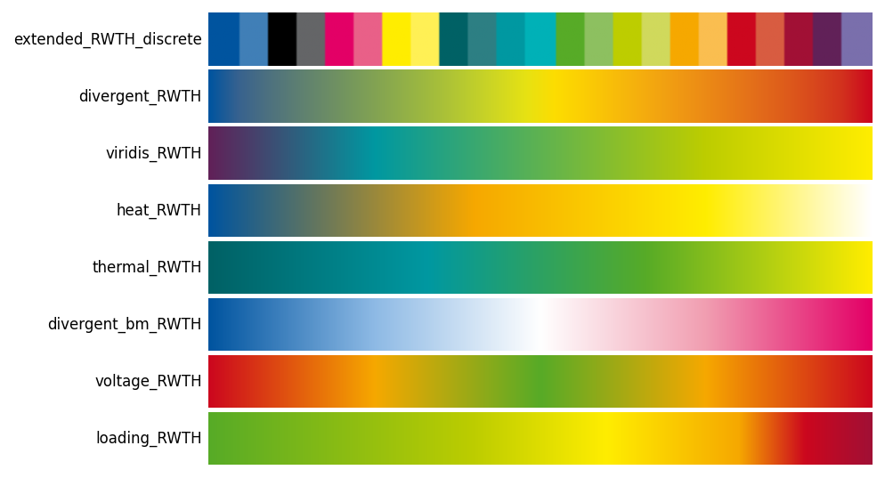

# Colormaps

41 colormaps are registered with Matplotlib automatically on `import rwthplots`.
All are accessible via `plt.set_cmap()`, `plt.get_cmap()`, or the
[`rwth_cmap()`][rwthplots.cmap.rwth_cmap] factory.



## Using colormaps

```python
import matplotlib.pyplot as plt
from rwthplots.cmap import rwth_cmap

# Standard Matplotlib interface
plt.set_cmap("divergent_RWTH")

# Factory — returns a LinearSegmentedColormap
cmap = rwth_cmap("extended_RWTH_discrete", lut=13)

# Use with imshow, contourf, scatter, etc.
ax.imshow(data, cmap=rwth_cmap("loading_RWTH"))
```

## Discrete maps

| Name | Colours | Description |
|---|---|---|
| `extended_RWTH_discrete` | 1–65 (`lut=`) | Full RWTH palette ordered for maximum contrast |
| `continuous_RWTH_discrete` | 1–65 (`lut=`) | Continuous coverage of the full 65-colour palette |

## Diverging maps

| Name | Description |
|---|---|
| `divergent_RWTH` | Blue → green → red |
| `divergent_bm_RWTH` | Blue – white – magenta |
| `divergent_gy_RWTH` | Green – white – yellow |
| `voltage_RWTH` | Red → orange → green → orange → red (symmetric, use with `TwoSlopeNorm`) |
| `frequency_RWTH` | Blue → green (nominal) → red |

## Sequential maps

| Name | Description |
|---|---|
| `viridis_RWTH` | Violet → turquoise → may green → yellow (perceptual) |
| `heat_RWTH` | Blue → orange → white |
| `thermal_RWTH` | Petrol → turquoise → green → yellow |
| `loading_RWTH` | Blue → green → yellow → orange → red → bordeaux |
| `renewable_RWTH` | Black → orange → yellow → may green → green |
| `blue_RWTH` | Blue tint gradient (100 % → 10 %) |
| *(+ 13 single-colour gradients)* | One per RWTH base colour |

## Power-system colormaps

Designed for power-system analysis and grid visualisation:

=== "Voltage deviation"

    ```python
    import matplotlib.colors as mcolors
    norm = mcolors.TwoSlopeNorm(vcenter=1.0, vmin=0.88, vmax=1.12)
    ax.imshow(voltages, cmap=rwth_cmap("voltage_RWTH"), norm=norm)
    ```

    `voltage_RWTH` — symmetric red → orange → green → orange → red.
    Centre at nominal voltage (1.0 pu).

=== "Line loading"

    ```python
    cmap = rwth_cmap("loading_RWTH")
    colors = [cmap(min(loading, 1.0)) for loading in line_loadings]
    ax.bar(labels, line_loadings * 100, color=colors)
    ```

    `loading_RWTH` — blue (unloaded) → green → yellow → orange → red → bordeaux (overloaded).

=== "Renewable fraction"

    ```python
    ax.imshow(renewable_share, cmap=rwth_cmap("renewable_RWTH"),
              vmin=0, vmax=1)
    ```

    `renewable_RWTH` — black → orange → yellow → may green → green.

=== "Frequency deviation"

    ```python
    norm = mcolors.Normalize(vmin=-0.5, vmax=0.5)
    colors = rwth_cmap("frequency_RWTH")(norm(freq_deviation))
    ```

    `frequency_RWTH` — blue → green (nominal, 50 Hz) → red.

## Colour sets (qualitative)

Named palettes for discrete data, returned as a namedtuple:

```python
from rwthplots.cmap import rwth_cset

cset = rwth_cset("rwth_100")        # full-intensity RWTH colours
cset.blue                           # '#00549F'
cset.orange                         # '#F6A800'

# Other tint levels
cset_75  = rwth_cset("rwth_75")
cset_50  = rwth_cset("rwth_50")
cset_25  = rwth_cset("rwth_25")
cset_10  = rwth_cset("rwth_10")

# Format conversion
cset_rgb  = rwth_cset("rwth_100", frmt="RGB")    # (R, G, B) integer tuples
cset_nrgb = rwth_cset("rwth_100", frmt="NRGB")   # normalised float tuples
```
