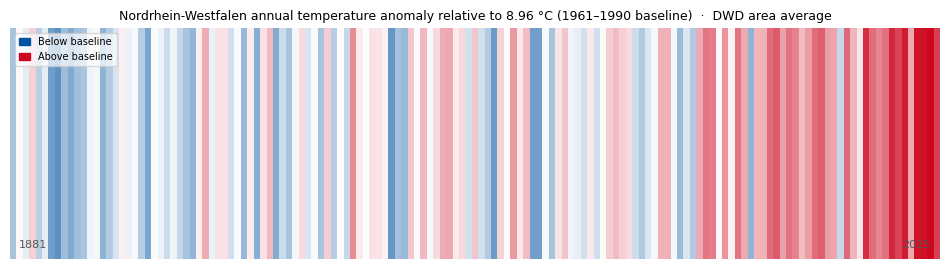

# Examples

All example scripts are in the `examples/` directory and can be run headlessly:

```sh
MPLBACKEND=Agg uv run python examples/<script>.py
```

## Climate stripes

**`examples/climate_stripes.py`**

Warming-stripes visualisation for **Nordrhein-Westfalen** using the official
DWD area-averaged annual mean temperature (1881–2025, 145 years, no gaps).
Cold years in RWTH blue (`#00549F`), warm years in RWTH red (`#CC071E`),
opacity proportional to the magnitude of the anomaly relative to the
1961–1990 baseline (~8.96 °C).

The script downloads the data automatically from the DWD Climate Data Center
open-data server at runtime; no local data file is needed.



Inspired by [Ed Hawkins](https://showyourstripes.info), University of Reading.
Data: [DWD Climate Data Center](https://opendata.dwd.de/climate_environment/CDC/regional_averages_DE/annual/air_temperature_mean/).

## New features demo

**`examples/new_features_demo.py`**

Walkthrough of all v3.1 features:

- `plot_color_palette()` — 13 × 5 RWTH tint grid
- New colormaps: `viridis_RWTH`, `thermal_RWTH`,
  `divergent_bm_RWTH`, `divergent_gy_RWTH`
- `pick_colors(n)` — greedy farthest-point colour selection
- `check_accessibility()` — CVD simulation and delta-E report
- Size and journal style modifiers
- `save_figure()` multi-format export
- `misc.colorblind` CVD-safe cycle

## Power-systems demo

**`examples/power_systems_demo.py`**

Power-system colormaps demonstrated on realistic scenarios:

| Figure | Colormap | Use case |
|---|---|---|
| 2D bus voltage grid | `voltage_RWTH` | Voltage magnitude deviations (pu) |
| Line loading bar chart | `loading_RWTH` | Thermal loading 0–100 %+ |
| Colormap strips | both | Side-by-side overview |

```python
# Example: voltage map with symmetric normalisation
import matplotlib.colors as mcolors
from rwthplots.cmap import rwth_cmap

norm = mcolors.TwoSlopeNorm(vcenter=1.0, vmin=0.88, vmax=1.12)
ax.imshow(voltages, cmap=rwth_cmap("voltage_RWTH"), norm=norm)
```

## Palette and colour examples

**`examples/colours_example.py`** — `plot_color_palette()` and colour set demo.

**`examples/cmaps_example.py`** — renders gradient and line-plot previews for
every registered colormap into `examples/figures/cmaps/`.
